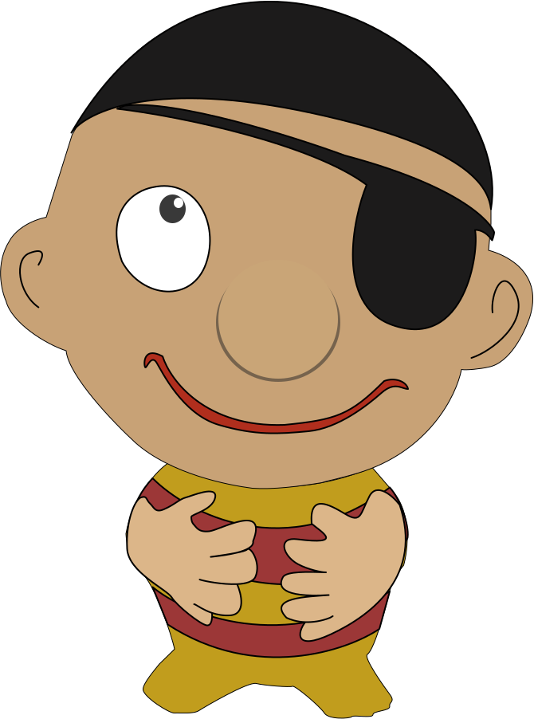
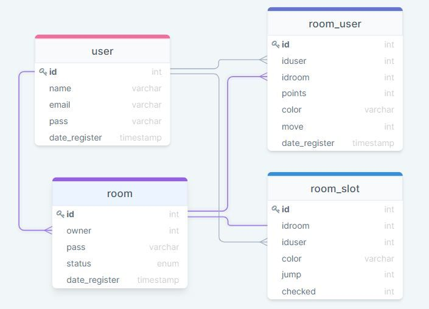

  

<h2 align="center">Pula Pirata</h2>

  

  

  

# Pula Pirata

Pula pirata is an online multiplayer game, inspired in the classic "Jump Pirate" game.

It can be played at:

- https://www.adelsonguimaraes.com.br/pula_pirata/prototipo/

- The portuguese project documentation can be found [here](https://opposite-eyelash-d55.notion.site/Pula-Pirata-HUB-76adb9e4317a4495b65e0ac12ce7f26f).

## Overview

The idea for the project arose based on the famous toy of the same name, in which it is possible to play from 2 to 4 players, where the purpose of the game is to avoid hitting the hole in the barrel that has the trigger to make the pirate jump.

## How it works

The game's functionality is very straight forward which makes it dynamic and enjoyable.
Basically, each person must select a slot in the barrel and click it to mark it with its color, but be careful when choosing, because you have a chance to click the slot that makes the pirate jump. The game ends when someone marks the slot that causes the pirate to be fired.

## Technologies

The following tools and technologies were used to build the game:

- [PHP](https://php.net/)
- [JavaScript](https://www.javascript.com/)
- [Figma](https://www.figma.com/)
- [HTML](https://www.w3schools.com/html/)
- [CSS](https://www.w3schools.com/css/)
- [API Rest](https://www.w3schools.com/rest/default.asp)
- [MVC Pattern](https://www.w3schools.com/php/php_mvc_pattern.asp)
- [MySQL Database](https://www.w3schools.com/php/php_mysql_database.asp)

## Requirements

The project uses vanilla PHP and Javascript, so you will need to have a web server with PHP support.

## Assets

Figma models:

- [Pula Pirata](https://www.figma.com/file/GBKzVQjfyDhOGIWiBmBZrY)

## Database UML

The database UML is as follows:

  

## License

The project is under the MIT license.
